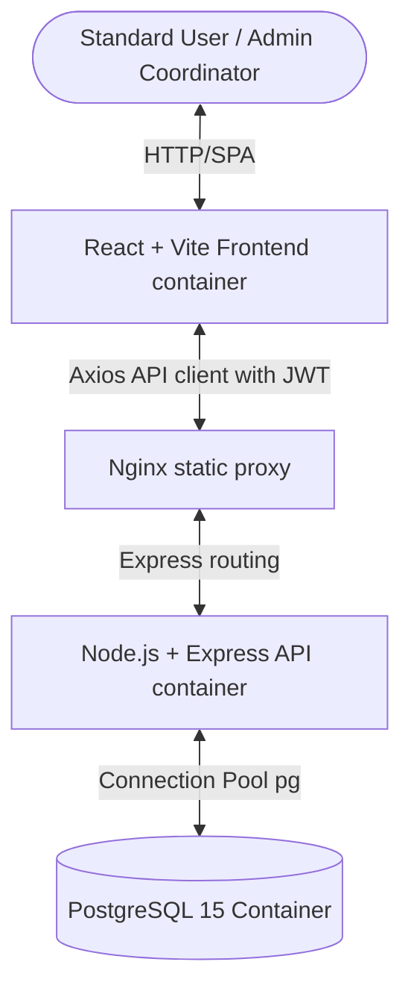

# System Architecture & Technical Design Document

This design document outlines the technical architecture, database normalizations, core algorithms, and concurrency-handling mechanisms for the Smart Asset Management and Resource Allocation Platform.

---

## 1. Architectural Overview

The application follows a decoupled multi-tier architecture containerized with Docker:



* **Client Tier**: A React Single Page Application (SPA) compiled with Vite. Communication is handled via a configured Axios instance injecting JWT bearer tokens into request headers.
* **API Tier**: An Express.js application handling JWT verification, role validation, data validation, audit logging, and transactional service coordination.
* **Database Tier**: PostgreSQL 15, ensuring ACID compliance, relational integrity, cascade deletions, and index-optimized query speeds.

---

## 2. Database Design & Entity Normalization

We normalize database dependencies to prevent anomalies and support multi-item checkout requests.

### Custom PostgreSQL ENUMs
```sql
CREATE TYPE user_role AS ENUM ('admin', 'user');
CREATE TYPE asset_status AS ENUM ('active', 'maintenance', 'damaged');
CREATE TYPE asset_condition AS ENUM ('excellent', 'good', 'fair', 'poor', 'damaged');
CREATE TYPE booking_status AS ENUM ('pending', 'approved', 'rejected', 'issued', 'returned', 'overdue');
CREATE TYPE maintenance_status AS ENUM ('pending', 'in-progress', 'resolved');
```

### Table Normalization Layout

#### `users`
Tracks authorized members with hashed password keys.
* `id` (SERIAL, PK)
* `name` (VARCHAR)
* `email` (VARCHAR, Unique index)
* `password_hash` (VARCHAR)
* `role` (user_role)

#### `assets`
Maintains inventory data. `quantity_available` is dynamically updated by dispatch/return checkins.
* `id` (SERIAL, PK)
* `name` (VARCHAR)
* `category` (VARCHAR, check-constraint bounded)
* `description` (TEXT)
* `quantity_total` (INT, check >= 0)
* `quantity_available` (INT, check >= 0)
* `status` (asset_status)
* `condition` (asset_condition)
* `qr_code_base64` (TEXT)

#### `bookings` (Parent Booking Request)
Represents the date window, purpose, and overall status of a loan request.
* `id` (SERIAL, PK)
* `user_id` (INT, FK -> users)
* `start_date` (DATE)
* `end_date` (DATE)
* `due_date` (DATE)
* `purpose` (TEXT)
* `status` (booking_status)
* `remarks` (TEXT)

#### `booking_items` (Child Booking Items - Junction table)
Supports multi-asset bookings. Tracks checkout times and return conditions for each individual asset.
* `id` (SERIAL, PK)
* `booking_id` (INT, FK -> bookings, cascade delete)
* `asset_id` (INT, FK -> assets, cascade delete)
* `quantity` (INT, check > 0)
* `issued_at` (TIMESTAMP)
* `returned_at` (TIMESTAMP)
* `return_condition` (asset_condition)
* *Unique Constraint*: `(booking_id, asset_id)`

#### `maintenance_logs`
Tracks malfunctioning assets reported by users or flagged on return.
* `id` (SERIAL, PK)
* `asset_id` (INT, FK -> assets)
* `reported_by` (INT, FK -> users)
* `issue_description` (TEXT)
* `status` (maintenance_status)
* `cost` (DECIMAL)
* `resolved_at` (TIMESTAMP)

#### `notifications` & `audit_logs`
* `notifications`: User alert logs.
* `audit_logs`: Detailed system transaction trails tracking administrator edits.

---

## 3. Core Algorithms

### A. Overbooking Prevention (Temporal Availability)
Instead of static decrements on request creation (which would freeze inventory for unapproved bookings), the system checks overlapping dates.

**Mathematical Logic**:
Two bookings $B_1(S_1 \to E_1)$ and $B_2(S_2 \to E_2)$ overlap if and only if:
$$\text{Overlap}(B_1, B_2) \iff \neg(E_1 < S_2 \lor S_1 > E_2)$$

**SQL Implementation**:
```sql
SELECT COALESCE(SUM(bi.quantity), 0) as booked_qty
FROM booking_items bi
JOIN bookings b ON bi.booking_id = b.id
WHERE bi.asset_id = $1
  AND b.status IN ('approved', 'issued')
  AND NOT (b.end_date < $2 OR b.start_date > $3);
```
Where `$2` is the requested start date and `$3` is the requested end date. The available quantity is calculated as:
$$\text{Available} = \text{Total Quantity} - \text{Booked Quantity}$$

---

### B. Concurrency Locking Proof
Under high traffic (e.g. multiple admins approving bookings at the same time), a race condition could permit overbooking.

**Proof of Transaction Protection**:
1. When an admin starts the approval workflow, the system locks the booking row and queries the assets:
   ```sql
   SELECT name, quantity_total, status FROM assets WHERE id = $1 FOR UPDATE
   ```
2. The `FOR UPDATE` lock forces any concurrent transaction trying to read or write this asset row to halt.
3. The query calculates overlapping bookings *after* acquiring the lock.
4. If the requested quantity exceeds the lock-updated available stock, the transaction aborts and rolls back:
   ```sql
   ROLLBACK;
   ```
5. If stock is sufficient, the booking updates to `approved` and the lock is released upon commit.
6. This guarantees that at any instant $T$, the sum of approved allocations for asset $A$ during range $D$ can never exceed $A\text{.quantity\_total}$, ensuring mathematical consistency.

---

## 4. UI/UX Design System

* **Glassmorphism Panels**: Utilizes Tailwind backdrop-blurs (`backdrop-filter: blur(12px)`) combined with low-opacity borders (`border-white/8`) and dark background fills (`slate-950/55`) to construct high-contrast panels.
* **Visual Status Indication**: Live status indicators highlight overdue items and alert users of stock availability immediately.
* **Notifications Bell Feed**: Interceptor database logs are pooled in the header navbar so standard users receive updates immediately when booking requests change states.
