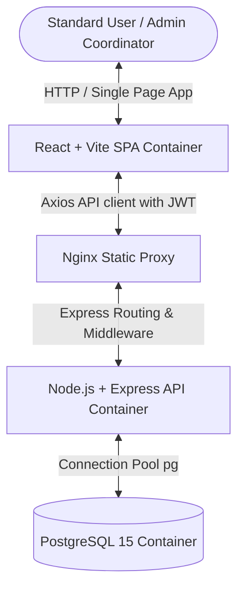
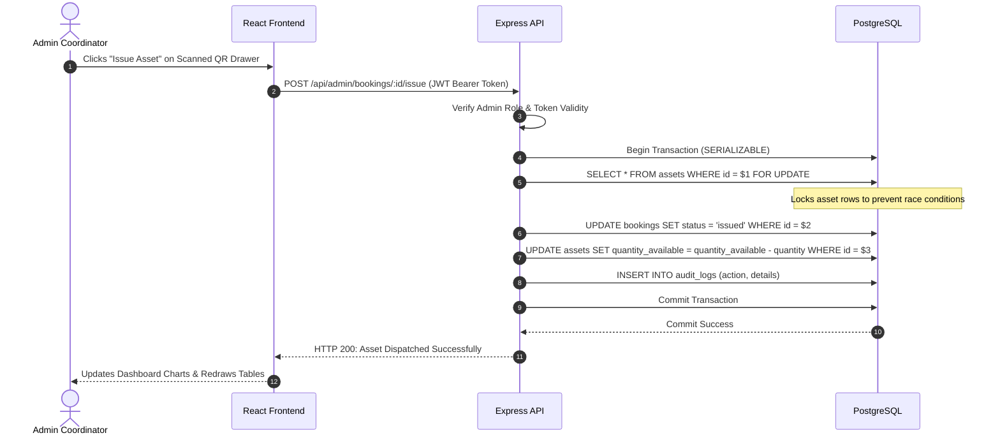
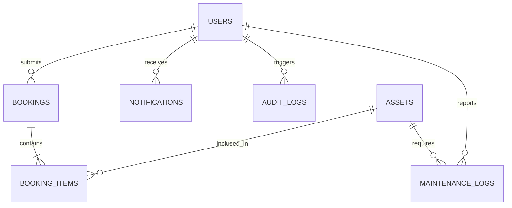

# System Architecture & Technical Design Document
**Smart Asset Management & Resource Allocation Platform**
*Designed for IIT Roorkee Cultural Council*

---

## 1. Problem Understanding

### The Challenge
University student groups and cultural clubs (spanning music, dramatics, photography, etc.) coordinate a shared pool of physical equipment assets, including DSLR cameras, studio lights, mixers, speakers, costumes, and stage props. Without a centralized orchestration platform, clubs face multiple operational pain points:
* **Double-Booking Conflicts**: Two distinct events scheduling the same items concurrently, resulting in last-minute equipment shortages.
* **Lack of Inventory Visibility**: Officers cannot search available stock lists or ascertain if items are currently checked out, overdue, or under repair.
* **No Checkout Accountability**: Equipment dispatches and returns are logged informally (or not at all), leading to missing items and untraceable damage.
* **Unmonitored Health & Maintenance**: Broken gear is returned without repair reports, leaving subsequent clubs with faulty equipment. No cost tracking exists for repairs.
* **Missing Audit Ledger**: Actions are untraceable, making it impossible to audit coordinate histories, approvals, or losses.

### Objectives and Expected Outcomes
* **Temporal Conflict Resolution**: Prevent overbooking programmatically using overlapping-interval calculations.
* **Role-Based Workflows**: Separate permissions for Standard Users (requestors) and Admin Coordinators (approvers/operators).
* **QR-Assisted Operations**: Leverage QR codes to trigger instantaneous equipment dispatches (checkouts) and returns (check-ins) directly on mobile devices.
* **Comprehensive Health Control**: Systematically route damaged returns to maintenance tickets, tracking repair logs, costs, and condition restorations.
* **Full Audit Trail**: Record every single state mutation (creation, approval, rejection, checkout, return, repair resolution) in an immutable audit database ledger.

---

## 2. System Architecture

The platform utilizes a decoupled, multi-tier system architecture containerized via Docker for reproducibility:



* **Client Tier**: A Single Page Application built using React, Vite, and Tailwind CSS. The app implements a glassmorphism dashboard UI with interactive controls, dynamic warning alerts, and real-time state changes. All network communications are executed using an Axios instance with an interceptor that dynamically injects JSON Web Tokens (JWT) into request authorization headers.
* **Reverse Proxy / Nginx**: Handles request forwarding, serving the built React static files, and routing requests matching `/api/*` to the Express backend container.
* **API Tier**: Node.js/Express application. Implements a Router-Controller-Model architecture:
  * **JWT Middleware**: Validates caller identity.
  * **Role Middleware**: Restricts admin-only endpoints.
  * **Controller Layer**: Coordinates business workflows, database operations, and error handling.
* **Database Tier**: PostgreSQL 15, executing atomic operations, relational integrity checks, cascade deletions, and index-optimized queries.

### Request Flow Diagram (Booking Approval & Stock Issuance)



---

## 3. Database Schema

We define schema components inside PostgreSQL to guarantee ACID compliance. The structure includes custom PostgreSQL enums, primary-foreign key linkages, integrity check constraints, and performance indexes.

### Custom Database ENUMs
```sql
CREATE TYPE user_role AS ENUM ('admin', 'user');
CREATE TYPE asset_status AS ENUM ('active', 'maintenance', 'damaged');
CREATE TYPE asset_condition AS ENUM ('excellent', 'good', 'fair', 'poor', 'damaged');
CREATE TYPE booking_status AS ENUM ('pending', 'approved', 'rejected', 'issued', 'returned', 'overdue');
CREATE TYPE maintenance_status AS ENUM ('pending', 'in-progress', 'resolved');
```

### Table Definitions & Key Constraints

#### 1. `users`
Tracks authorized members and hashed credentials.
* `id` (SERIAL PRIMARY KEY)
* `name` (VARCHAR(100) NOT NULL)
* `email` (VARCHAR(100) UNIQUE NOT NULL)
* `password_hash` (VARCHAR(255) NOT NULL)
* `role` (user_role NOT NULL DEFAULT 'user')
* `created_at` (TIMESTAMP WITH TIME ZONE DEFAULT CURRENT_TIMESTAMP)

#### 2. `assets`
Maintains physical items inventory catalog.
* `id` (SERIAL PRIMARY KEY)
* `name` (VARCHAR(100) NOT NULL)
* `category` (VARCHAR(50) NOT NULL CHECK (category IN ('DSLR Cameras', 'Studio Lighting Equipment', 'Audio Systems', 'Costumes', 'Stage Props', 'Recording Equipment', 'Event Infrastructure')))
* `description` (TEXT)
* `quantity_total` (INT NOT NULL CHECK (quantity_total >= 0))
* `quantity_available` (INT NOT NULL CHECK (quantity_available >= 0))
* `status` (asset_status NOT NULL DEFAULT 'active')
* `condition` (asset_condition NOT NULL DEFAULT 'excellent')
* `qr_code_base64` (TEXT)
* `created_at` (TIMESTAMP WITH TIME ZONE DEFAULT CURRENT_TIMESTAMP)

#### 3. `bookings`
Parent transaction containing booking dates, status, and purposes.
* `id` (SERIAL PRIMARY KEY)
* `user_id` (INT REFERENCES users(id) ON DELETE CASCADE NOT NULL)
* `start_date` (DATE NOT NULL)
* `end_date` (DATE NOT NULL)
* `due_date` (DATE)
* `purpose` (TEXT NOT NULL)
* `status` (booking_status NOT NULL DEFAULT 'pending')
* `remarks` (TEXT)
* `created_at` (TIMESTAMP WITH TIME ZONE DEFAULT CURRENT_TIMESTAMP)
* *Constraint*: `CHECK (start_date <= end_date)`

#### 4. `booking_items`
Child transaction junction table supporting multi-asset requests.
* `id` (SERIAL PRIMARY KEY)
* `booking_id` (INT REFERENCES bookings(id) ON DELETE CASCADE NOT NULL)
* `asset_id` (INT REFERENCES assets(id) ON DELETE CASCADE NOT NULL)
* `quantity` (INT NOT NULL CHECK (quantity > 0))
* `issued_at` (TIMESTAMP WITH TIME ZONE)
* `returned_at` (TIMESTAMP WITH TIME ZONE)
* `return_condition` (asset_condition)
* *Constraint*: `UNIQUE (booking_id, asset_id)`

#### 5. `maintenance_logs`
Tracks malfunctioning gear, costs, and resolution statuses.
* `id` (SERIAL PRIMARY KEY)
* `asset_id` (INT REFERENCES assets(id) ON DELETE CASCADE NOT NULL)
* `reported_by` (INT REFERENCES users(id) ON DELETE SET NULL)
* `issue_description` (TEXT NOT NULL)
* `status` (maintenance_status NOT NULL DEFAULT 'pending')
* `cost` (DECIMAL(10,2) DEFAULT 0.00 CHECK (cost >= 0.00))
* `resolved_at` (TIMESTAMP WITH TIME ZONE)
* `created_at` (TIMESTAMP WITH TIME ZONE DEFAULT CURRENT_TIMESTAMP)

#### 6. `notifications` & `audit_logs`
* `notifications`: User-specific in-app messages.
* `audit_logs`: Detailed tracking records for compliance verification.

---

## 4. Entity Relationship Diagram (ERD)

The relational mappings among database entities are outlined below:



* **Users to Bookings**: 1-to-Many. A user can request multiple bookings over time.
* **Bookings to Booking Items**: 1-to-Many (Cascade Delete). A single booking request can reserve multiple items in parallel.
* **Assets to Booking Items**: 1-to-Many. Each physical asset can be referenced in multiple booking item transactions.
* **Assets to Maintenance Logs**: 1-to-Many. An asset can have multiple historical repair cycles.

---

## 5. API Overview

All API requests are prefixed with `/api` and expect JSON payloads.

| Category | HTTP Method | Route Endpoint | Role Required | Request Body | Response Content | Description |
| :--- | :--- | :--- | :--- | :--- | :--- | :--- |
| **Auth** | `POST` | `/auth/register` | Public | `{name, email, password}` | `{token, user}` | Registers a new account |
| **Auth** | `POST` | `/auth/login` | Public | `{email, password}` | `{token, user}` | authenticates user & returns JWT |
| **Auth** | `GET` | `/auth/me` | User / Admin | None | `{id, name, email, role}` | Verifies active session token |
| **Assets** | `GET` | `/assets` | User / Admin | None | `[assets]` | Retrieves catalog list |
| **Assets** | `GET` | `/assets/:id` | User / Admin | None | `{asset, history}` | Detail profile and repair timeline |
| **Assets** | `POST` | `/assets` | Admin | `{name, category, description, quantity_total}` | `{asset}` | Adds a new inventory asset |
| **Bookings** | `POST` | `/bookings` | User / Admin | `{start_date, end_date, purpose, items: [{id, quantity}]}` | `{booking}` | Submits multi-item booking request |
| **Bookings** | `GET` | `/bookings` | User / Admin | None | `[bookings]` | Gets user's list (all lists for Admin) |
| **Bookings** | `POST` | `/bookings/:id/approve` | Admin | None | `{booking}` | Approves booking request |
| **Bookings** | `POST` | `/bookings/:id/reject` | Admin | `{remarks}` | `{booking}` | Rejects request with comments |
| **Bookings** | `POST` | `/bookings/:id/issue` | Admin | None | `{booking}` | Dispatches (checks out) asset |
| **Bookings** | `POST` | `/bookings/:id/return` | Admin | `{return_condition, damage_description}` | `{booking}` | Checks in asset; logs damage if poor/damaged |
| **Maintenance**| `GET` | `/maintenance` | Admin | None | `[tickets]` | Lists all active & resolved tickets |
| **Maintenance**| `POST` | `/maintenance/:id/resolve`| Admin | `{cost, condition_after}` | `{ticket}` | Resolves ticket & sets asset active |
| **Logs** | `GET` | `/logs` | Admin | None | `[audit_logs]` | Lists all admin audits |
| **Logs** | `GET` | `/logs/notifications` | User / Admin | None | `[notifications]` | Fetches active alerts / overdue alerts |
| **Logs** | `POST` | `/logs/notifications/read` | User / Admin | None | `{success}` | Marks all notifications as read |

---

## 6. Design Decisions

### A. Stateless JWT Authentication
We chose JSON Web Tokens (JWT) rather than cookie-based sessions. Because the server is stateless, the API container can scale horizontally behind Nginx load balancing without needing a shared session cache (such as Redis).

### B. Normalization Layout for Multi-Item Checkout
Instead of storing asset checkouts directly on a `bookings` table, we decoupled the architecture using a parent `bookings` table and a child `booking_items` junction table. This design supports multi-item checkout requests (e.g., booking a camera, lens, and microphone under a single event request) while avoiding redundant columns and database anomalies.

### C. Mathematical Temporal Availability (Concurrency Strategy)
Standard inventory platforms decrement availability statically on reservation request. In a high-traffic environment, this causes artificial stock-outs for requests that may eventually be rejected.
Our system queries temporal availability dynamically:
* Available stock for requested dates is computed by subtracting approved overlapping allocations from the total quantity.
* During the Admin approval transition, we issue a PostgreSQL `SELECT ... FOR UPDATE` row lock on the affected assets. This blocks parallel transactions, ensuring that overlapping bookings cannot cause overbooking under race conditions.

### D. QR Workflow Integration
We encode asset profiles using base64-encoded strings representing the asset ID. Clicking the QR scanner on the client reads the asset ID and immediately opens an interactive control drawer. Instead of navigating lists, admins can instantly checkout or checkin gear in-field.

### E. Append-Only Audit Logging
To meet strict security requirements, audit logs are stored in an append-only table. No `UPDATE` or `DELETE` API endpoints exist for the `audit_logs` model. This preserves an untampered timeline of all equipment handovers and repair cost cycles.
