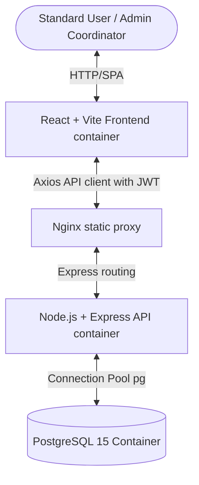
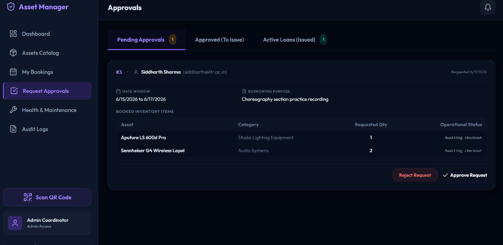
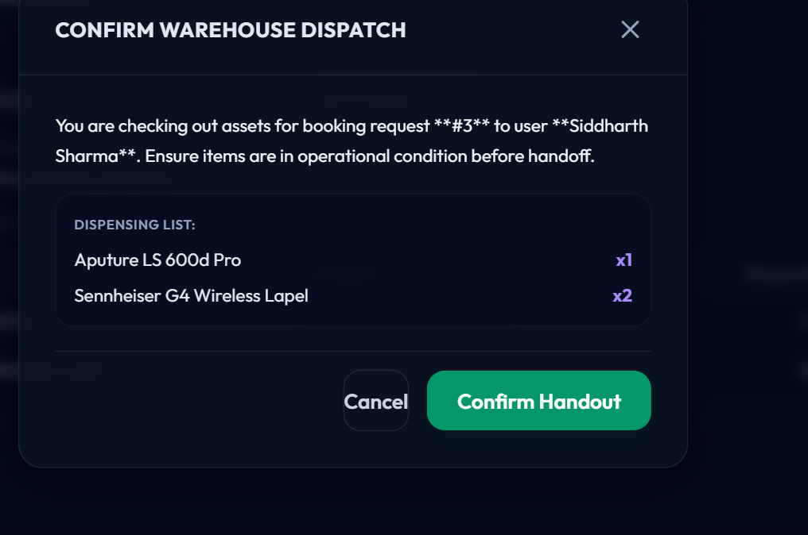
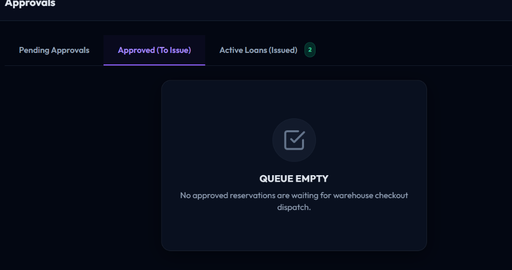
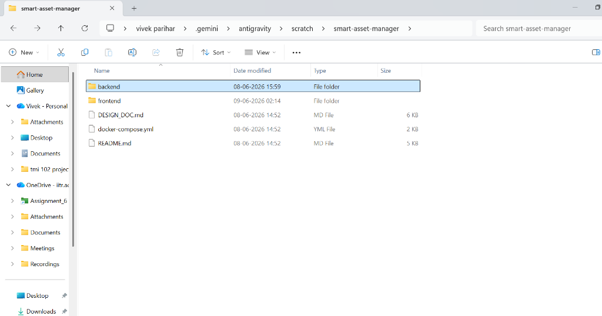
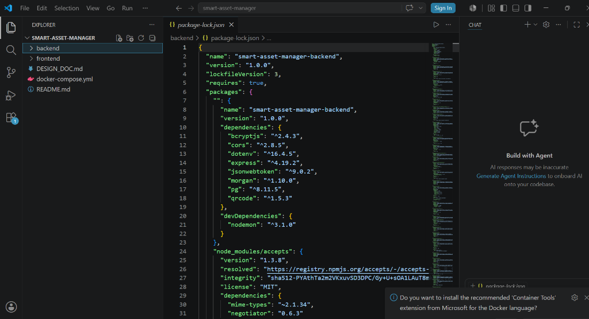

# Smart Asset Management and Resource Allocation Platform
**IIT Roorkee Cultural Council Coordination Dashboard**

---

## 1. Project Overview
This platform is a comprehensive, full-stack web application designed for university clubs and councils (modeled after the Cultural Council at IIT Roorkee) to coordinate shared equipment inventories. It automates booking requests, checks temporal availability, implements role-based approvals, tracks equipment check-ins/check-outs via QR scanning, and manages repairs and audit logging.

---

## 2. Problem Statement Summary
Managing physical inventories (cameras, lights, audio systems, stage props) across multiple student clubs faces several key issues:
* **Double-Booking**: Conflicting schedules for high-demand gear.
* **Lack of Visibility**: Users cannot verify what assets exist, their current status, or when they will return.
* **Poor Accountability**: No logs of who handled what, leading to lost or untracked items.
* **Maintenance Silos**: Gear is returned broken without notification, delaying future events.
* **No Audit Trail**: Administration cannot track changes, approvals, or costs.

---

## 3. Features Implemented
The application implements 12 core functional modules:
* **User Authentication**: Secure JWT session auth with Login and Signup endpoints.
* **Asset Discovery Catalog**: Interactive grid with search filters, category tags, and inventory metrics.
* **Asset Repair History**: Modal timeline tracking the repair costs and logs of each asset.
* **Asset Booking Cart**: Support for requesting multiple assets for custom dates under a single purpose.
* **Double-Booking Checker**: Real-time overlapping dates check to prevent over-allocation.
* **Admin Approvals Board**: Panel to approve, reject, or comment on requested bookings.
* **In-field QR Dispatches**: Simulated QR scanner that admins can click to instantly Issue/Return items.
* **Health & Repair Control**: Auto-routes poor-condition returns to maintenance logs.
* **Audit Trails**: Non-modifiable transactional history tracking all admin updates.
* **Real-time Alert Notifications**: Notifications bell list alerting users of approvals and overdue notices.
* **Analytics Center**: Visual graphs tracking Average Loan Duration, Availability Ratio, and Monthly Trends.
* **Docker Orchestration**: Complete multi-container system deployment.

---

## 4. Technology Stack
* **Frontend**: React (Vite) + Tailwind CSS + Lucide Icons + Chart.js
* **Backend**: Node.js + Express.js + node-postgres (`pg` client connection pool)
* **Database**: PostgreSQL 15 (ACID-compliant transactional relational storage)
* **Reverse Proxy**: Nginx (orchestrated via Docker Compose)
* **Containerization**: Docker & Docker Compose v2

---

## 5. System Architecture

The platform utilizes a multi-tier architecture containerized with Docker:



For concurrency protection, booking approvals execute database row locking:
`SELECT * FROM assets WHERE id = $1 FOR UPDATE`
This guarantees that concurrent transaction checks are fully isolated and prevents double-booking race conditions.

---

## 6. Installation Instructions

### Prerequisites
* **Node.js**: Version 18 or 20+
* **PostgreSQL**: Version 14 or 15+

### Step-by-Step Setup
1. Clone the repository:
   ```bash
   git clone https://github.com/vivekparihar6009/smart-asset-manager.git
   cd smart-asset-manager
   ```
2. Set up the Database:
   Create a PostgreSQL database named `smart_asset_manager` locally.
   ```bash
   createdb -U postgres smart_asset_manager
   ```
3. Initialize the schema and seed mock data:
   ```bash
   cd backend
   npm run db:init
   ```

---

## 7. Environment Variables Setup

Create a `.env` file inside the `backend/` directory using the following values:

```env
PORT=5000
DB_USER=postgres
DB_PASSWORD=your_database_password
DB_HOST=localhost
DB_PORT=5432
DB_NAME=smart_asset_manager
JWT_SECRET=iitr_cultural_council_secret_token_key_2026
NODE_ENV=development
```

---

## 8. Running Backend

Run the Express.js backend server:
```bash
cd backend
npm install
npm run dev
```
The server starts on `http://localhost:5000`.

---

## 9. Running Frontend

Run the React/Vite development server:
```bash
cd frontend
npm install
npm run dev
```
The server starts on `http://localhost:3000` (requests proxy to backend).

---

## 10. Running With Docker

Launch the complete ecosystem (Database, Express Server, and Nginx/React Proxy) using a single command:
```bash
# From the root directory containing docker-compose.yml
docker-compose up --build
```
Once initialized, visit `http://localhost:3000` to access the application.

---

## 11. API Overview

| Method | Path | Access Role | Description |
| :--- | :--- | :--- | :--- |
| `POST` | `/api/auth/register` | Public | Registers a new user |
| `POST` | `/api/auth/login` | Public | Authenticates user & returns JWT |
| `GET` | `/api/assets` | User / Admin | Lists all assets |
| `POST` | `/api/assets` | Admin | Adds a new asset |
| `POST` | `/api/bookings` | User / Admin | Submits a new booking |
| `POST` | `/api/bookings/:id/approve` | Admin | Approves a booking |
| `POST` | `/api/bookings/:id/reject` | Admin | Rejects a booking |
| `POST` | `/api/bookings/:id/issue` | Admin | Dispatches (issues) asset |
| `POST` | `/api/bookings/:id/return` | Admin | Receives asset return |
| `GET` | `/api/maintenance` | Admin | Lists maintenance tickets |
| `POST` | `/api/maintenance/:id/resolve` | Admin | Resolves a ticket |
| `GET` | `/api/logs` | Admin | Fetches audit logs |

---

## 12. Screenshots

### Dashboard Analytics


### Assets Discovery Catalog


### Personal Bookings History


### Admin Request Approvals Desk


### Health & Maintenance Board


---

## 13. Future Improvements
* **Automated QR Generation**: Integrate direct PDF generation containing physical label sheets for print.
* **Email & SMS Reminders**: Add automatic email reminders for bookings approaching due date using nodemailer.
* **NFC Integration**: Support mobile phone tap-to-checkout in addition to camera-based QR scans.
* **Fine-Grained Club Permissions**: Implement sub-councils and sub-roles where specific users are restricted to booking assets belonging only to their designated club.
